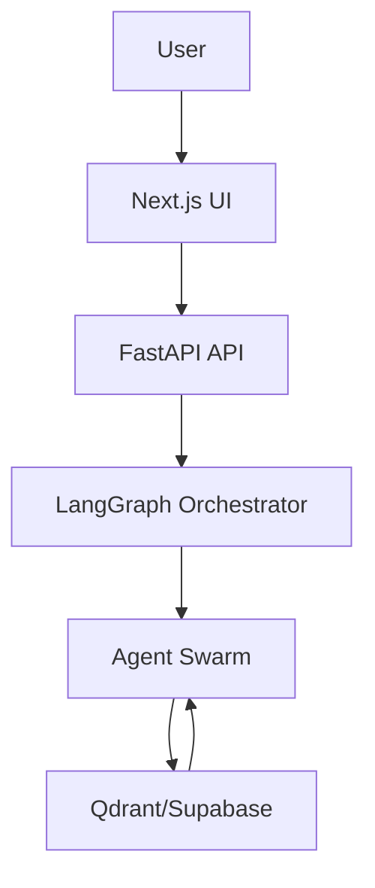

# 🛡️ Aegis Forge


## 🚀 Features
- **Agentic Workflow:** Multi-agent orchestration (LangGraph) for robust, scalable coding.
- **Next.js 16 Frontend:** Modern UI, App Router, TailwindCSS, Lucide Icons.
- **FastAPI Backend:** Python 3.12+, async, resilient API layer.
- **Immunology System:** AI-driven error learning and prevention.
- **Vector & Relational DB:** Qdrant (vector), Supabase/Postgres (relational).

---

## 🏗️ Architecture Diagram (Mermaid)


---

## ⚡ Quick Installation Guide

### 1. Clone & Setup
```bash
git clone https://github.com/your-org/aegis-forge.git
cd aegis-forge
```

### 2. Build & Run with Docker
```bash
docker-compose up --build
```

### 3. Manual Setup (Dev)
#### Backend
```bash
cd backend
python -m venv .venv
source .venv/bin/activate  # Windows: .venv\Scripts\activate
pip install -r requirements.txt
uvicorn main:app --reload
```
#### Frontend
```bash
cd frontend
npm install
npm run dev
```

---

## 🧬 Tech Stack
- **Frontend:** Next.js 16, React, TailwindCSS, Lucide Icons
- **Backend:** FastAPI (Python 3.12+), Uvicorn
- **Orchestration:** LangGraph (Stateful, Multi-Agent)
- **DB:** Qdrant (Vector), Supabase/Postgres (Relational)
- **DevOps:** Docker, docker-compose
- **Testing:** Pytest, httpx

---

> Built for robust, scalable, and autonomous coding workflows.
